# 🎬 Movie Review System  
### *Your Personal Cinema Universe — Discover. Review. Experience.*

---
🔗 **Live Demo:** https://srutinadar26-movie-review-system.vercel.app/movie/83533
---

---
## 🌌 Overview

**Movie Review System** is a production-grade, full-stack web application inspired by platforms like Netflix and IMDb. Built using React and Firebase, it allows users to explore, review, and personalize their movie journey across a catalog of **50,000+ films spanning 30+ languages and global regions**.

From discovering hidden gems to curating your own watchlist, the platform delivers a seamless, immersive cinematic experience.

---

## ✨ Core Features

- 🌍 Browse **50,000+ movies** across genres and 30+ languages  
- 🎬 Watch **trailers and teasers directly within the platform**  
- 🎭 View **detailed cast information with roles**  
- 🔎 Advanced filtering by **genre, language, year, and popularity**  
- ⭐ Access **ratings, release data, and detailed overviews**  
- 📝 Write, delete, and manage **user reviews**  
- ❤️ Create and manage a **personalized watchlist**  
- 🎯 Get **personalized recommendations**  
- 📊 Track **user activity and engagement**  
- 🔒 Secure authentication with **protected routes**  
- 📱 Fully **responsive design across all devices**

---

## 🧠 Architecture

- Component-based architecture using React  
- Context API for global state management  
- Modular folder structure for scalability  
- Separation of concerns (UI, services, logic)  

---

## 🛠️ Tech Stack

### Frontend
- React.js (Hooks, Context API)  
- React Router  

### Backend / Services
- Firebase Authentication  

### API & Data
- TMDb API  
- Axios  

### Storage
- LocalStorage (reviews, favorites, activity)  

### Styling
- CSS3 (Flexbox, Grid, Responsive Design)  

---

---

## 🔌 API Integration

Integrated with **TMDb API** to fetch:

- Movie listings (popular, trending, top-rated, upcoming)  
- Movies by genre, language, and region  
- Cast details, trailers, and metadata  
- Search and filtered results  
- Recommendation data  

---

## ⚙️ Setup & Installation

### 1. Clone the repository
```bash
git clone https://github.com/srutinadar26/movie-review-system.git
cd movie-review-system
```

---

---
## 📸 Screenshots

### 🎥 Explore the Experience

| 🏠 Home | 🎬 Trailer |
|--------|-----------|
| 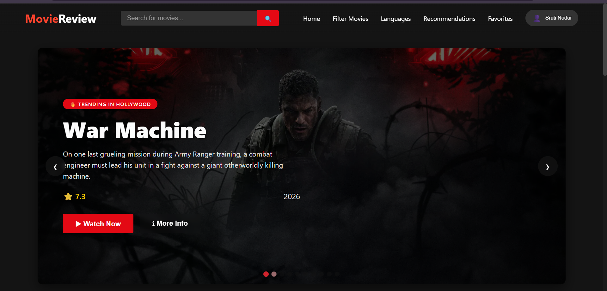 | 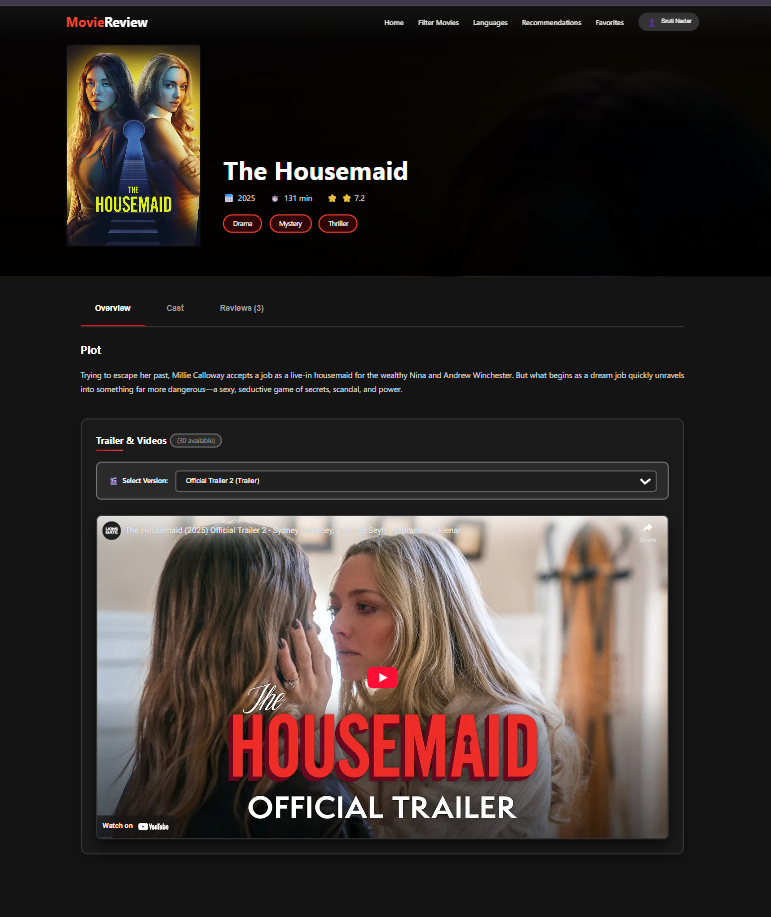 |

| 🎭 Cast | 🎞️ Movies |
|--------|-----------|
| 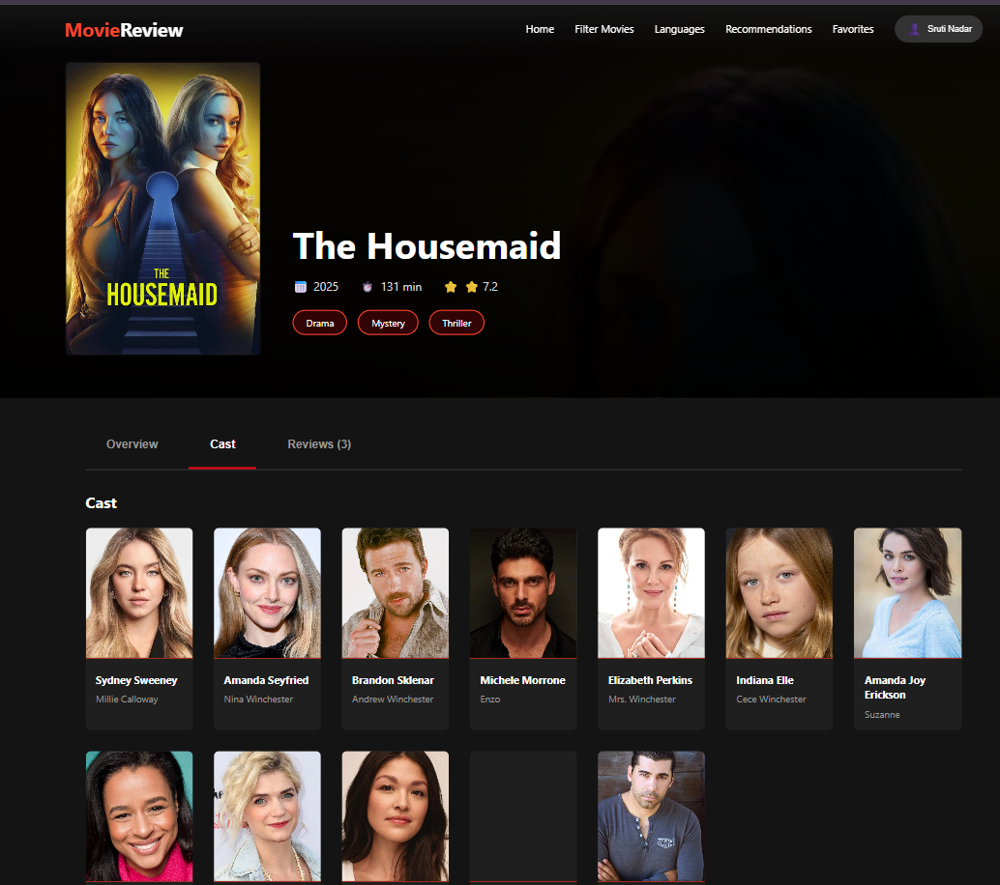 | 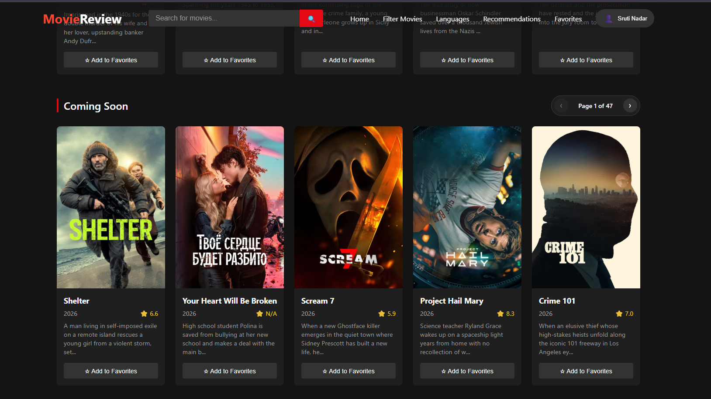 |

| 🔍 Filter | 🌐 Languages |
|----------|-------------|
| 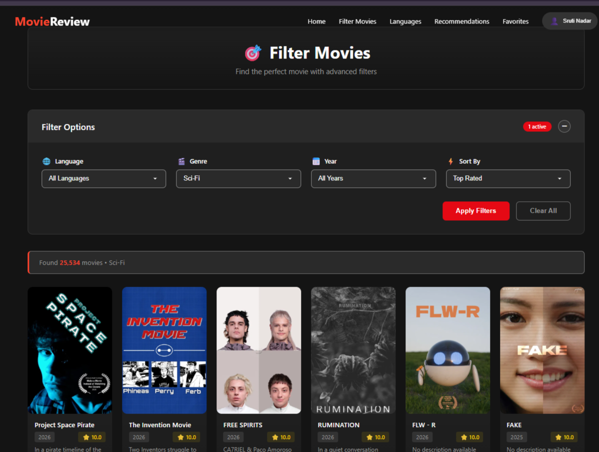 | 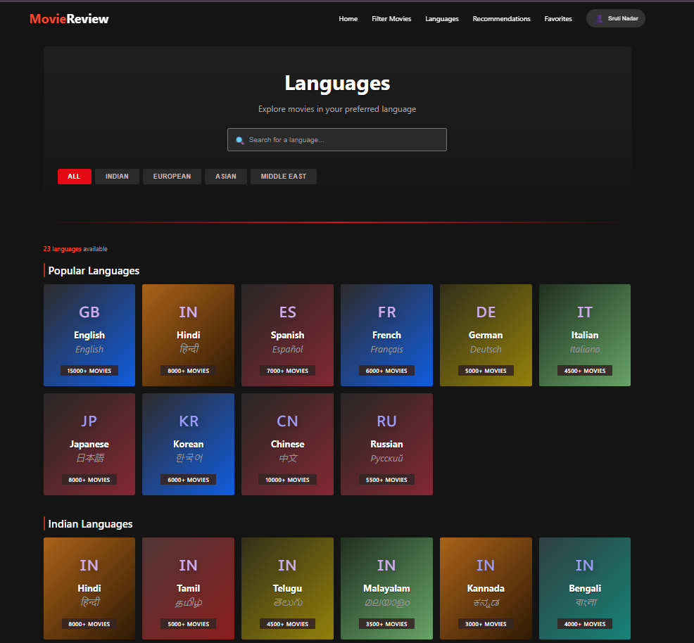 |

| 👤 Profile | ❤️ Favorites |
|-----------|-------------|
| 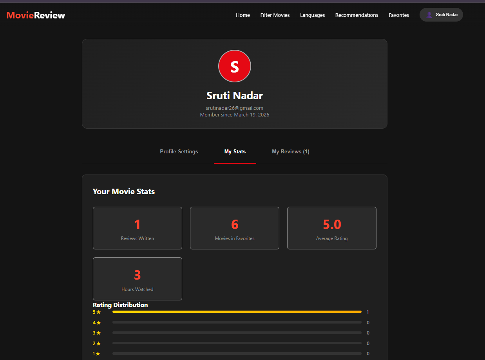 | 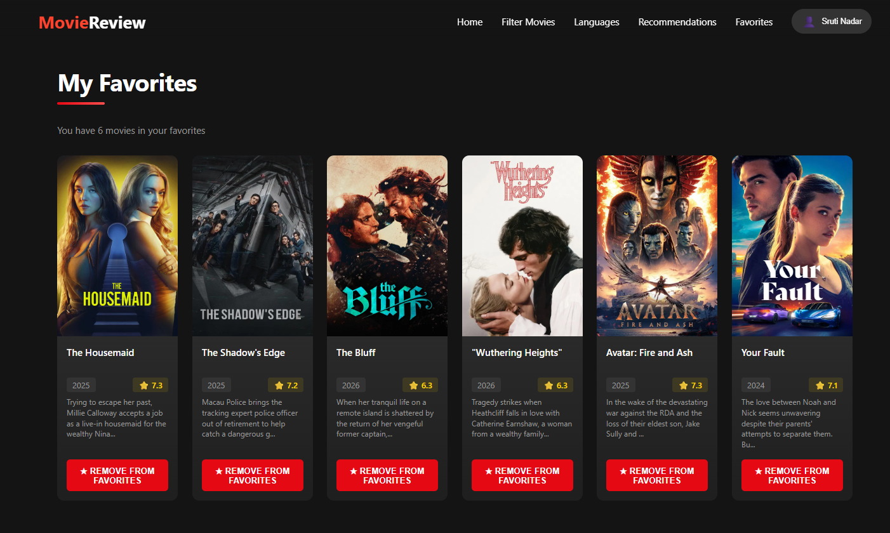 |

| ⭐ Ratings | 📝 Reviews |
|----------|------------|
| 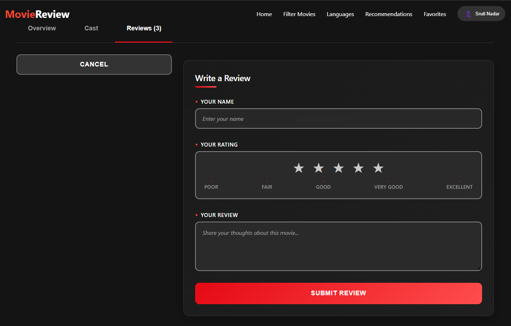 | 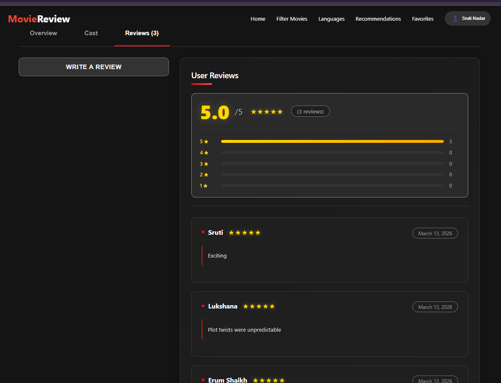 |

| 🎯 Recommendations | 📊 Activity |
|------------------|------------|
| 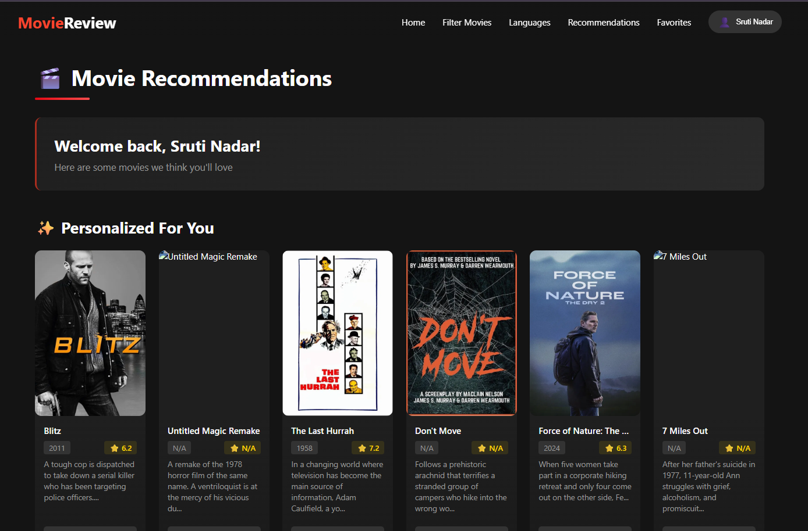 | 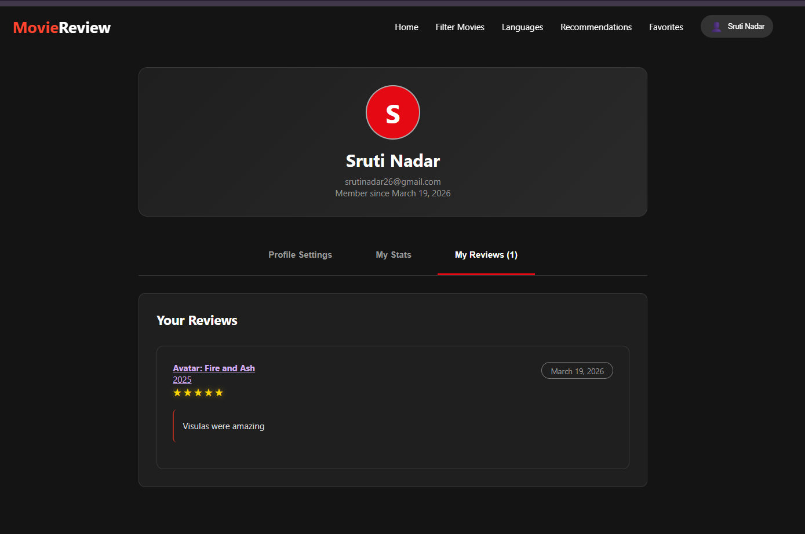 |


## 🏆 Highlights

* Handles **large-scale movie data (50K+ records across genres & languages)**
* Implements **advanced filtering and recommendation system**
* Tracks **user activity and engagement**
* Demonstrates **full-stack integration (React + Firebase)**
* Built with **scalable and modular architecture**
* Delivers **production-level UI/UX experience**

---

## 📄 License

For educational and portfolio use.

---
